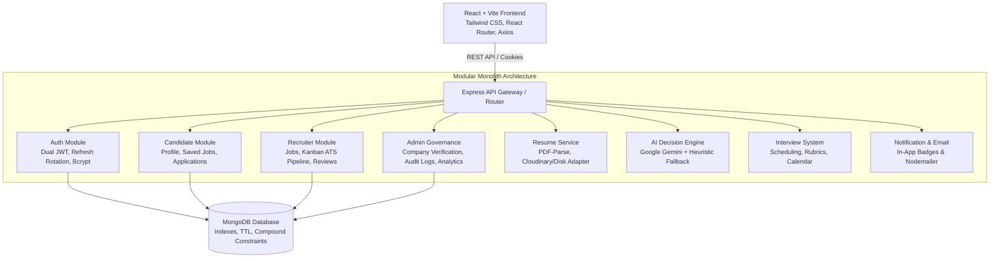
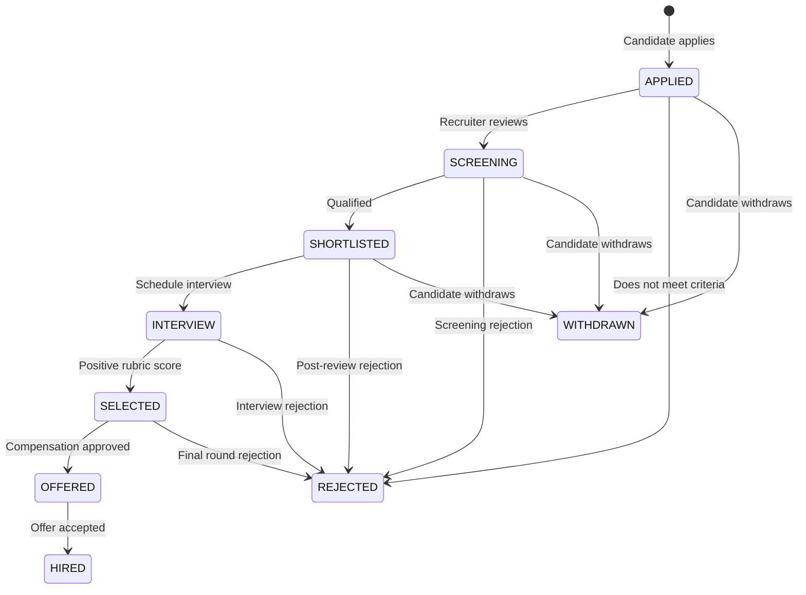

# HireFlow ATS - Enterprise Job Recruitment & Applicant Tracking System

[](https://github.com)
[](https://github.com)
[](https://github.com)

**HireFlow ATS** is a production-style commercial SaaS platform engineered for modern talent acquisition teams and job seekers. Unlike toy CRUD projects, HireFlow implements strict business workflows, valid Applicant Tracking System (ATS) pipeline state machine transitions, dual JWT token rotation with HTTP-only cookies, AI-assisted resume parsing & job matching (Google Gemini with deterministic heuristic fallbacks), structured interview rubrics, real-time in-app notifications, and audit trail logging.

Designed with a **light-first, professional SaaS design system** (deep blue/indigo accents, crisp charcoal typography, generous whitespace, and subtle micro-animations) without AI-generated neon gradients or floating blobs.

---

## Architecture Overview



---

## Core Business Workflows & State Machine

HireFlow enforces a strict state machine inside the service layer. Arbitrary status changes are rejected with descriptive validation feedback.



---

## Role-Based Access Control (RBAC)

### 1. Candidate
* Register, login, verify email, forgot/reset password
* Complete professional profile (headline, bio, skills chip manager, social links)
* Upload and parse resume documents (PDF, DOC, DOCX up to 5MB)
* View AI extracted skills, career summaries, strengths, and targeted improvement suggestions
* Faceted job discovery with search, location, work mode, employment type, and salary filters
* Save jobs for later review
* Apply for published requisitions (duplicate applications strictly prevented by compound database indexes)
* Real-time application tracking with historical progression timestamps
* Review upcoming interview invitations and join virtual meeting rooms
* In-app notification center with unread counters and read status management

### 2. Recruiter & Employer
* Register and create company profile (starts in `PENDING` review state)
* Multi-section requisition builder: Overview, Compensation, Qualifications, Application Settings
* **AI Assist Breakdown**: Uses Gemini to analyze job descriptions and auto-suggest required competencies and responsibilities
* Save requisitions as **Draft** or **Publish** (only verified companies can publish live jobs)
* Close job listings when requisitions are filled
* **ATS Kanban Pipeline Board**: Visual multi-column workflow (`Applied` → `Screening` → `Shortlisted` → `Interview` → `Selected` → `Offered` → `Hired`)
* Candidate Evaluation Modal: View match scores (0-100%), matched vs missing skills, resume documents, and author internal recruiter notes
* Schedule interviews with date/time, duration, type (Online/Phone/Onsite), and meeting link
* Submit structured evaluation scorecards (Technical, Communication, Culture alignment ratings + final recommendation)
* Recruitment analytics: Pipeline volume, hiring conversion rates, and requisition throughput

### 3. Administrator
* Platform overview with real MongoDB aggregation statistics (total users, candidates, recruiters, companies, active jobs, applications, interviews, hires)
* Global ATS Funnel conversion distribution
* User Governance: Inspect all platform accounts, filter by role, and activate/deactivate accounts
* Employer Company Verification: Review pending companies, approve with instant publishing permissions, or reject with a reason
* Job Moderation: Audit all requisitions across employers and force close or delete non-compliant postings
* Security Audit Trail: Searchable log tracking user actions, target entities, IP addresses, and timestamps
* System configuration dashboard and direct link to OpenAPI/Swagger UI

---

## Technology Stack

### Frontend
* **Core**: React 19, JavaScript, Vite
* **Styling**: Vanilla Tailwind CSS v4, Light-First Design System tokens
* **Routing**: React Router DOM (v7) with role-protected route guards
* **API Client**: Axios with automatic 401 refresh token interceptors
* **Icons & Animation**: Lucide React, Framer Motion
* **Forms & Validation**: Standard React forms with robust validations

### Backend
* **Runtime**: Node.js v22 (ES Modules)
* **Framework**: Express.js (Modular Monolith architecture)
* **Database**: MongoDB & Mongoose ORM
* **Authentication**: Dual JWT (15-min access token + 7-day HTTP-only refresh token rotation)
* **Password Hashing**: Bcryptjs with salt rounds
* **Security**: Helmet, CORS, Express-Rate-Limit, query sanitization
* **File Uploads**: Multer memory storage with MIME & file extension validation
* **File Storage**: Cloudinary SDK (with local disk `/uploads` fallback)
* **Artificial Intelligence**: Google Gemini API (`@google/generative-ai` with smart deterministic heuristic fallback)
* **Email System**: Nodemailer with SMTP (with dev console fallback)
* **API Documentation**: Swagger UI & OpenAPI 3.0 specification (`/api/docs`)
* **Testing**: Jest & Supertest automated integration test suite

---

## One-Click Seed Demo Accounts

The database comes seeded with rich, realistic enterprise demo data:

| Role | Email | Password | Access Capabilities |
| :--- | :--- | :--- | :--- |
| **Administrator** | `admin@hireflow.dev` | `Password123!` | Full platform governance, company approval, moderation, audit logs |
| **Recruiter** | `recruiter@hireflow.dev` | `Password123!` | Lead recruiter at CloudScale Technologies, ATS Kanban pipeline, interviews |
| **Candidate** | `candidate@hireflow.dev` | `Password123!` | Full-stack software engineer profile, applications, resume, scheduled interview |

> On the login page (`/login`), click the **One-Click Demo Accounts** buttons to instantly log in as any role.

---

## Directory Structure

```text
HireFlow ATS/
├── backend/
│   ├── src/
│   │   ├── config/             # Database, Cloudinary, Email, Env, Swagger specs
│   │   ├── middleware/         # Authenticate, Authorize, ErrorHandler, Upload, RateLimiter
│   │   ├── modules/
│   │   │   ├── auth/           # Controller, Service, Routes, Validation, User & RefreshToken Models
│   │   │   ├── candidates/     # Candidate profile, applications, saved jobs
│   │   │   ├── recruiters/     # Recruiter profile, company relation
│   │   │   ├── companies/      # Company CRUD and verification workflow
│   │   │   ├── jobs/           # Requisitions, faceted search, save & apply logic
│   │   │   ├── applications/   # Strict ATS state machine, candidate tracking, recruiter notes
│   │   │   ├── resumes/        # Multer upload, PDF parse, AI analysis, primary resume
│   │   │   ├── interviews/     # Scheduling, evaluation scorecards & rubrics
│   │   │   ├── notifications/  # In-app notification center
│   │   │   ├── ai/             # Gemini resume/job analysis & matching
│   │   │   └── admin/          # Platform stats, user moderation, audit logs
│   │   ├── services/           # Storage, Email, Notification, and AI services
│   │   ├── utils/              # ApiError, ApiResponse, Logger, Pagination, Constants
│   │   ├── app.js              # Express app setup, CORS, Helmet, routes mount
│   │   └── server.js           # Server bootstrap
│   ├── seeds/
│   │   └── seedDatabase.js     # Comprehensive realistic enterprise seed script
│   ├── tests/
│   │   └── ats.test.js         # Jest & Supertest integration tests
│   ├── uploads/                # Local uploads fallback directory
│   ├── .env.example
│   └── package.json
│
├── frontend/
│   ├── src/
│   │   ├── components/
│   │   │   ├── ui/             # Button, Input, Select, Textarea, Modal, Card, StatusBadge, Badge, Skeleton, EmptyState
│   │   │   └── common/         # WordmarkLogo, NotificationBell
│   │   ├── layouts/            # PublicLayout, CandidateLayout, RecruiterLayout, AdminLayout, AuthLayout
│   │   ├── pages/
│   │   │   ├── public/         # LandingPage, JobsPage, JobDetailsPage, CompaniesPage
│   │   │   ├── auth/           # LoginPage, RegisterPage, ForgotPasswordPage, ResetPasswordPage, VerifyEmailPage
│   │   │   ├── candidate/      # CandidateDashboard, ApplicationsPage, ApplicationDetailsPage, SavedJobsPage, ResumePage, ProfilePage, CandidateInterviewsPage
│   │   │   ├── recruiter/      # RecruiterDashboard, MyJobsPage, CreateJobPage, JobApplicationsKanbanPage, RecruiterInterviewsPage, CompanyProfilePage, RecruiterAnalyticsPage
│   │   │   └── admin/          # AdminDashboard, UsersManagementPage, CompaniesVerificationPage, JobModerationPage, AuditLogsPage, AdminSettingsPage
│   │   ├── routes/             # AppRoutes and ProtectedRoute guards
│   │   ├── services/           # Axios instance with auto 401 refresh token interceptors
│   │   ├── store/              # AuthContext and NotificationContext
│   │   ├── constants/          # Shared enums and status constants
│   │   ├── index.css           # Light-first design tokens & custom scrollbars
│   │   ├── App.jsx
│   │   └── main.jsx
│   ├── index.html
│   ├── vite.config.js
│   └── package.json
│
└── README.md
```

---

## Getting Started Locally

### Prerequisites
* Node.js v18+ (tested on Node.js v22)
* MongoDB (Running locally on default port `27017` or MongoDB Atlas URI)

### 1. Backend Setup
```bash
cd backend

# Install dependencies
npm install

# Copy sample environment configuration
cp .env.example .env

# Seed the database with demo accounts, companies, jobs, applications, and interviews
npm run seed

# Run automated integration tests
npm test

# Start backend server
npm start
```
* Backend server: `http://localhost:5000`
* Interactive Swagger API Docs: `http://localhost:5000/api/docs`

### 2. Frontend Setup
```bash
cd frontend

# Install dependencies
npm install

# Start Vite development server
npm run dev
```
* Frontend client: `http://localhost:5174` (or `http://localhost:5173`)

---

## Environment Variables Reference

```ini
PORT=5000
NODE_ENV=development
CLIENT_URL=http://localhost:5174

# Database
MONGODB_URI=mongodb://localhost:27017/hireflow_ats

# JWT Authentication
JWT_ACCESS_SECRET=hireflow_super_secret_access_key_2026_change_in_production
JWT_REFRESH_SECRET=hireflow_super_secret_refresh_key_2026_change_in_production
JWT_ACCESS_EXPIRY=15m
JWT_REFRESH_EXPIRY=7d

# File Storage (Optional - fallback to local disk storage automatically)
CLOUDINARY_CLOUD_NAME=
CLOUDINARY_API_KEY=
CLOUDINARY_API_SECRET=

# AI Engine (Optional - fallback to smart deterministic heuristic parser)
GEMINI_API_KEY=

# Email Dispatcher (Optional - logs to console during development)
SMTP_HOST=smtp.ethereal.email
SMTP_PORT=587
SMTP_USER=
SMTP_PASSWORD=
SMTP_FROM="HireFlow ATS" <no-reply@hireflow.dev>
```

---

## Automated Test Verification

Run the test suite from the `backend/` directory:
```bash
npm test
```
Validates:
1. Admin, Recruiter, and Candidate authentication
2. Role-based route protection (Candidates blocked from Admin stats with 403 Forbidden)
3. Published job search and pagination metadata
4. Duplicate application prevention (409 Conflict)
5. Legal vs illegal ATS state machine transitions (e.g. attempting to skip from `APPLIED` directly to `HIRED` is rejected with 400 Bad Request)

---

## Interactive API Documentation

Interactive Swagger OpenAPI 3.0 documentation is available when running the backend:
`http://localhost:5000/api/docs`

Provides schemas, request parameters, authorization headers, and live execution across all endpoints:
* `/auth/*` (register, login, refresh, logout, verify-email, forgot-password, reset-password)
* `/candidates/*` (me, applications, saved-jobs, resumes)
* `/recruiters/*` (me, company)
* `/companies/*` (CRUD, verification status)
* `/jobs/*` (search, create, update, publish, close, save, apply)
* `/applications/*` (ATS pipeline view, status update, shortlist, reject, withdraw, notes)
* `/resumes/*` (upload, parse, primary)
* `/interviews/*` (schedule, list, update, submit feedback rubric)
* `/notifications/*` (list, mark read, mark all read)
* `/ai/*` (resume analysis, job analysis, job match, question generation)
* `/admin/*` (stats, users, companies, jobs moderation, audit logs)
